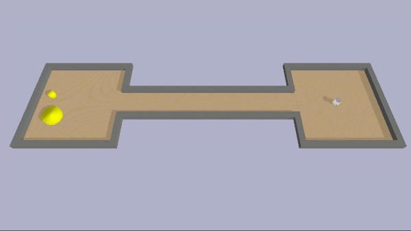

# Nonasymptotic-mp robot experiments

## Setup
PDDLStream is included as a submodule here. To install the submodule, clone it from the root of this project with

``git submodule update --init --recursive``

PDDLStream uses fast downward, which is a symbolic planning framework. Install it with this command

``./pddlstream/downward/build.py``

Run the example
``python turtlebot_move/run.py``

Run the kuka example
``python kuka_carry/run.py``

## Example

